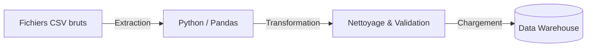
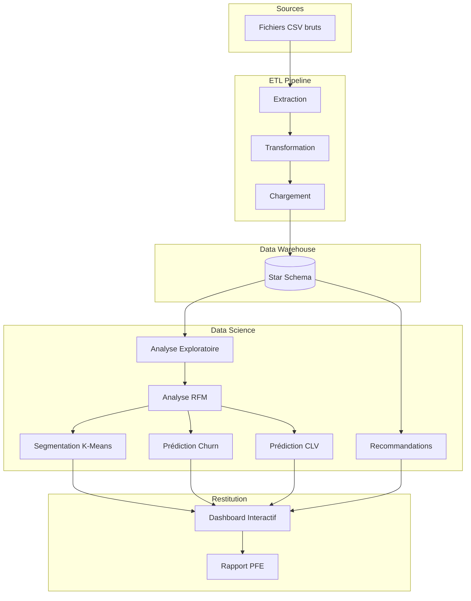
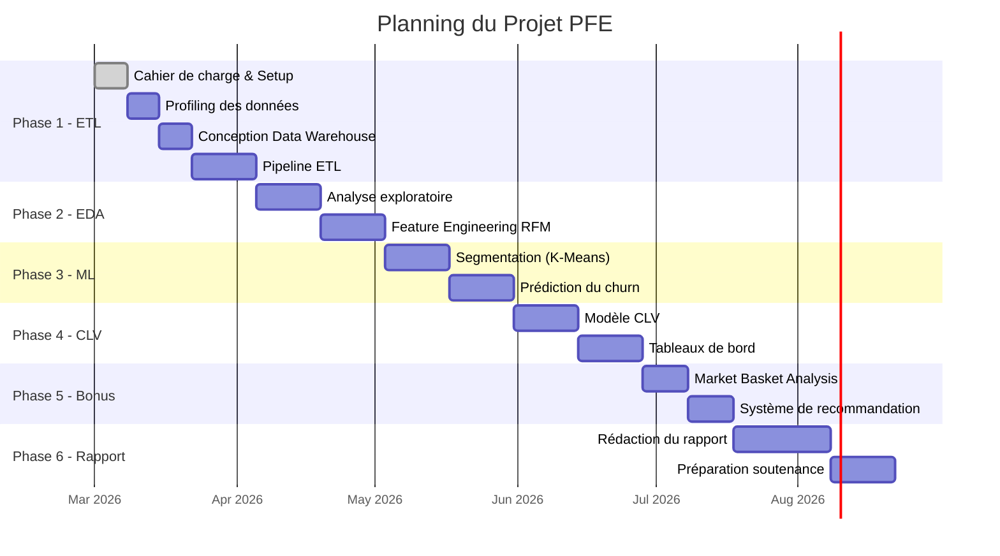

# Cahier de Charge — Projet de Fin d'Études

---

## 📄 Informations Générales

| Élément                     | Détail                                                                 |
| --------------------------- | ---------------------------------------------------------------------- |
| **Titre du projet**         | Analyse de la Valeur Client, Segmentation et Système de Recommandation |
| **Organisme d'accueil**     | Dislog Group                                                           |
| **Domaine**                 | Data Science & AI                                  |
| **Durée estimée**           | 5 à 6 mois                                                             |
| **Date de début**           | Mars 2026                                                              |
| **Date de fin prévue**      | Août 2026                                                              |
| **Encadrant(e) entreprise** | oussamaguemmar                                                         |
| \_                          |
| **Encadrant(e) académique** | Boutaina ETTETUANI                                                     |
| \_                          |
| **Stagiaire**               | Mohammed FAKIR \_                                                      |
| **Établissement**           | IT \_                                                                  |

---

## 1. Contexte du Projet

### 1.1 Présentation de l'organisme d'accueil

**Dislog Group** est un acteur majeur de la distribution et de la logistique au Maroc. Le groupe gère un large portefeuille de marques et assure la distribution de produits à travers tout le territoire national, couvrant plusieurs régions et secteurs d'activité.

### 1.2 Contexte et problématique

Dans un marché compétitif, la connaissance client constitue un levier stratégique essentiel. Dislog Group dispose d'un volume important de données transactionnelles (commandes, factures, clients, produits) mais n'exploite pas encore pleinement le potentiel de ces données pour :

- **Comprendre la valeur réelle de chaque client** et identifier les clients les plus rentables.
- **Anticiper le comportement client**, notamment le risque de perte (churn).
- **Personnaliser les actions commerciales** en fonction des segments de clients.
- **Découvrir les associations entre produits** pour optimiser les ventes croisées.

### 1.3 Enjeux

| Enjeu            | Description                                                             |
| ---------------- | ----------------------------------------------------------------------- |
| **Stratégique**  | Mieux connaître les clients pour orienter la stratégie commerciale      |
| **Opérationnel** | Identifier les clients à risque de churn et agir de manière proactive   |
| **Commercial**   | Augmenter le panier moyen grâce aux recommandations de produits         |
| **Décisionnel**  | Fournir des tableaux de bord interactifs pour le pilotage de l'activité |

---

## 2. Objectifs du Projet

### 2.1 Objectif principal

Développer une solution complète de Data Science permettant d'analyser la valeur client, segmenter la base clientèle, prédire le churn et proposer un système de recommandation de produits à partir des données transactionnelles de Dislog Group.

### 2.2 Objectifs spécifiques

| #   | Objectif                                                             | Livrable attendu                                            |
| --- | -------------------------------------------------------------------- | ----------------------------------------------------------- |
| O1  | Concevoir et alimenter un Data Warehouse à partir des données brutes | Pipeline ETL fonctionnel + base de données structurée       |
| O2  | Réaliser une analyse exploratoire approfondie des données            | Notebooks d'EDA avec visualisations                         |
| O3  | Construire un modèle de segmentation client basé sur l'analyse RFM   | Modèle de clustering + profils des segments                 |
| O4  | Développer un modèle de prédiction du churn                          | Modèle ML évalué (précision, rappel, AUC-ROC)               |
| O5  | Calculer et prédire la valeur vie client (CLV)                       | Modèle prédictif de CLV + classement des clients            |
| O6  | Construire un système de recommandation de produits _(bonus)_        | Moteur de recommandation basé sur le Market Basket Analysis |
| O7  | Créer des tableaux de bord interactifs                               | Dashboard de visualisation interactif                       |

---

## 3. Périmètre du Projet

### 3.1 Périmètre fonctionnel

#### Inclus dans le périmètre

- ✅ Collecte, nettoyage et transformation des données brutes (CSV)
- ✅ Conception d'un schéma en étoile (star schema)
- ✅ Analyse exploratoire des données (EDA)
- ✅ Segmentation client par analyse RFM et clustering
- ✅ Modèle de prédiction du churn
- ✅ Calcul et prédiction de la CLV
- ✅ Analyse du panier d'achat (Market Basket Analysis)
- ✅ Système de recommandation léger (filtrage collaboratif)
- ✅ Tableaux de bord interactifs

#### Exclus du périmètre

- ❌ Déploiement en production (le projet reste au stade prototype)
- ❌ Intégration avec les systèmes internes de Dislog (ERP, CRM)
- ❌ Traitement en temps réel (batch processing uniquement)
- ❌ Application mobile

### 3.2 Périmètre des données

| Table           | Description                                               | Volume estimé |
| --------------- | --------------------------------------------------------- | ------------- |
| **Region**      | Référentiel des régions                                   | ~2 Ko         |
| **Sector**      | Référentiel des secteurs                                  | ~8 Ko         |
| **Customer**    | Base clients (accountid, nom, région, secteur)            | ~4 Mo         |
| **Seller**      | Référentiel des vendeurs                                  | ~9 Ko         |
| **Product**     | Catalogue produits (itemid, nom, marque)                  | ~146 Ko       |
| **SalesHeader** | En-têtes des commandes (dates, montants)                  | ~123 Mo       |
| **SalesLine**   | Détail des lignes de commande (produit, qté, prix, promo) | ~719 Mo       |
| **Invoice**     | Factures (paiements, méthode de paiement)                 | ~66 Mo        |

> [!CAUTION]
> Les données sont **confidentielles** et ne doivent en aucun cas être partagées publiquement. Toute publication doit être anonymisée.

---

## 4. Description Fonctionnelle

### 4.1 Module 1 — Pipeline ETL



**Fonctionnalités** :

- Lecture des fichiers CSV avec gestion de l'encodage (ANSI/UTF-8)
- Nettoyage : suppression des doublons, gestion des valeurs manquantes, typage
- Validation : contrôle d'intégrité référentielle
- Chargement en masse dans la base de données

### 4.2 Module 2 — Analyse Exploratoire (EDA)

**Fonctionnalités** :

- Distribution des ventes par période (mois, trimestre, année)
- Répartition géographique du chiffre d'affaires (région, secteur)
- Analyse des top clients, produits et vendeurs
- Matrices de corrélation entre variables numériques

### 4.3 Module 3 — Segmentation Client

**Méthode** : Analyse RFM + Algorithmes de clustering

| Dimension RFM     | Définition                              |
| ----------------- | --------------------------------------- |
| **Recency (R)**   | Nombre de jours depuis le dernier achat |
| **Frequency (F)** | Nombre total de commandes               |
| **Monetary (M)**  | Montant total dépensé                   |

**Algorithmes** :

- **K-Means** : Segmentation en k clusters avec optimisation par méthode du coude et score de silhouette
- **DBSCAN** : Alternative pour détecter les clusters de formes non-sphériques
- **PCA** : Réduction dimensionnelle pour la visualisation 2D/3D

**Segments attendus** :

| Segment             | Description                                  | Action suggérée           |
| ------------------- | -------------------------------------------- | ------------------------- |
| 🏆 Champions        | Acheteurs fréquents, récents, à haute valeur | Programme de fidélité VIP |
| 💎 Clients fidèles  | Bonne fréquence, valeur moyenne-haute        | Offres de cross-selling   |
| 🌱 Nouveaux clients | Achat récent mais unique                     | Campagne de bienvenue     |
| ⚠️ À risque         | Anciens bons clients devenus inactifs        | Campagne de réactivation  |
| 💤 Dormants         | Aucune activité récente, faible valeur       | Enquête de satisfaction   |

### 4.4 Module 4 — Prédiction du Churn

**Définition du churn** : Un client est considéré en churn s'il n'a effectué aucun achat au cours des 90 derniers jours (seuil ajustable).

**Features utilisées** :

| Feature                   | Description                          |
| ------------------------- | ------------------------------------ |
| `recency`                 | Jours depuis le dernier achat        |
| `frequency`               | Nombre de commandes                  |
| `monetary`                | Montant total dépensé                |
| `avg_order_value`         | Montant moyen par commande           |
| `avg_days_between_orders` | Intervalle moyen entre commandes     |
| `total_products`          | Nombre de produits distincts achetés |
| `region`, `sector`        | Variables catégorielles (encodées)   |

**Modèles envisagés** :

| Modèle                | Rôle                                             |
| --------------------- | ------------------------------------------------ |
| Régression Logistique | Baseline simple et interprétable                 |
| Random Forest         | Bonne performance, résistant au surapprentissage |
| XGBoost               | Performance état de l'art, feature importance    |

**Métriques d'évaluation** : Accuracy, Precision, Recall, F1-Score, AUC-ROC

### 4.5 Module 5 — Valeur Vie Client (CLV)

**Approche** :

1. **CLV historique** : Somme des revenus générés par client
2. **CLV prédictive** : Modèle BG/NBD + Gamma-Gamma (ou régression) pour estimer la valeur future
3. **Classification** : Clients en tiers High / Medium / Low value

**Visualisations** :

- Diagramme de Pareto (80/20)
- Distribution de la CLV par segment
- Matrice CLV × Risque de churn

### 4.6 Module 6 — Système de Recommandation _(Bonus)_

**Approche en deux volets** :

**a) Market Basket Analysis** :

- Algorithme Apriori / FP-Growth sur les co-achats par commande
- Métriques : Support, Confiance, Lift
- Identification des produits complémentaires

**b) Filtrage Collaboratif** :

- Construction de la matrice Client × Produit
- Similarité cosinus entre clients
- Recommandation : _"Les clients similaires à vous ont aussi acheté…"_

> [!NOTE]
> En raison du volume élevé de la table SalesLine (~719 Mo), l'analyse sera réalisée sur un échantillon représentatif ou via l'algorithme FP-Growth, plus efficace que Apriori.

### 4.7 Module 7 — Tableaux de Bord

Dashboard interactif présentant :

- **Vue d'ensemble** : CA total, nombre de clients, panier moyen
- **Vue segmentation** : Répartition et évolution des segments clients
- **Vue churn** : Alertes sur les clients à risque
- **Vue CLV** : Ranking des clients par valeur prédite
- **Vue géographique** : Performance par région / secteur
- **Vue recommandations** : Associations de produits les plus fréquentes

---

## 5. Architecture Technique

### 5.1 Stack technologique

| Couche                | Technologie                                             |
| --------------------- | ------------------------------------------------------- |
| **Langage**           | Python 3.11+                                            |
| **Données**           | Pandas, NumPy                                           |
| **Base de données**   | SQL Server _(ou SQLite/PostgreSQL selon disponibilité)_ |
| **Machine Learning**  | Scikit-learn, XGBoost                                   |
| **Association Rules** | mlxtend (Apriori, FP-Growth)                            |
| **Visualisation**     | Matplotlib, Seaborn, Plotly                             |
| **Dashboard**         | Power BI et/ou Streamlit                                |
| **Notebooks**         | Jupyter Notebook                                        |
| **Versioning**        | Git / GitHub                                            |

### 5.2 Architecture de la solution



### 5.3 Structure du projet

```
dislog-pfe/
├── Data/                    # Données brutes (CSV)
├── notebooks/               # Jupyter notebooks par module
│   ├── 01_data_profiling.ipynb
│   ├── 02_eda.ipynb
│   ├── 03_rfm_analysis.ipynb
│   ├── 04_segmentation.ipynb
│   ├── 05_churn_prediction.ipynb
│   ├── 06_clv_model.ipynb
│   └── 07_market_basket.ipynb
├── src/                     # Modules Python réutilisables
│   ├── config.py
│   ├── etl/                 # Pipeline ETL
│   ├── features/            # Feature engineering (RFM, CLV)
│   ├── models/              # Modèles ML
│   └── viz/                 # Fonctions de visualisation
├── dashboard/               # Fichiers dashboard (Streamlit / Power BI)
├── reports/                 # Rapport PFE et slides
├── Schema.sql               # Schéma de la base de données
├── requirements.txt         # Dépendances Python
└── README.MD
```

---

## 6. Planning Prévisionnel



| Phase                              | Période         | Durée      | Livrables                             |
| ---------------------------------- | --------------- | ---------- | ------------------------------------- |
| **Phase 1** — Setup & ETL          | Mars 2026       | 5 semaines | Pipeline ETL, Data Warehouse alimenté |
| **Phase 2** — EDA & RFM            | Avril 2026      | 4 semaines | Notebooks d'analyse, features RFM     |
| **Phase 3** — ML Models            | Mai 2026        | 4 semaines | Modèles de segmentation et de churn   |
| **Phase 4** — CLV & Dashboard      | Juin 2026       | 4 semaines | Modèle CLV, dashboard interactif      |
| **Phase 5** — Recommandation       | Juil. 2026      | 3 semaines | Système de recommandation             |
| **Phase 6** — Rapport & Soutenance | Juil.–Août 2026 | 5 semaines | Rapport PFE, slides, soutenance       |

---

## 7. Livrables

| #   | Livrable                            | Format                | Date prévue  |
| --- | ----------------------------------- | --------------------- | ------------ |
| L1  | Cahier de charge                    | Document (.md / .pdf) | Mars 2026    |
| L2  | Pipeline ETL fonctionnel            | Code Python           | Mars 2026    |
| L3  | Notebooks d'analyse exploratoire    | Jupyter (.ipynb)      | Avril 2026   |
| L4  | Modèle de segmentation client       | Code + résultats      | Mai 2026     |
| L5  | Modèle de prédiction du churn       | Code + métriques      | Mai 2026     |
| L6  | Modèle de CLV prédictive            | Code + résultats      | Juin 2026    |
| L7  | Tableaux de bord interactifs        | Streamlit / Power BI  | Juin 2026    |
| L8  | Système de recommandation _(bonus)_ | Code + résultats      | Juillet 2026 |
| L9  | Rapport PFE                         | Document (.pdf)       | Août 2026    |
| L10 | Présentation de soutenance          | Slides (.pptx)        | Août 2026    |
| L11 | Code source complet                 | Dépôt GitHub          | Continu      |

---

## 8. Contraintes et Risques

### 8.1 Contraintes

| Type                | Contrainte                                                                      |
| ------------------- | ------------------------------------------------------------------------------- |
| **Confidentialité** | Les données sont confidentielles ; toute publication doit être anonymisée       |
| **Volume**          | Fichiers volumineux (~719 Mo pour SalesLine) nécessitant un traitement optimisé |
| **Encodage**        | Certains fichiers en ANSI (cp1252) plutôt qu'UTF-8                              |
| **Temps**           | Délai limité à 5-6 mois pour couvrir ETL + ML + Dashboard + Rapport             |

### 8.2 Risques identifiés

| Risque                                                         | Probabilité | Impact | Mitigation                                                                 |
| -------------------------------------------------------------- | ----------- | ------ | -------------------------------------------------------------------------- |
| Données de mauvaise qualité (valeurs manquantes, incohérences) | Moyenne     | Élevé  | Profiling approfondi dès la Phase 1, règles de nettoyage documentées       |
| Performance insuffisante sur les gros volumes                  | Moyenne     | Moyen  | Utilisation de chunked processing, échantillonnage pour le Market Basket   |
| Modèles ML avec faible performance prédictive                  | Faible      | Moyen  | Tester plusieurs algorithmes, optimiser les hyperparamètres                |
| Retard sur le planning                                         | Moyenne     | Élevé  | Le système de recommandation est un bonus ; peut être réduit si nécessaire |
| Problème d'accès à la base de données                          | Faible      | Élevé  | Solution de repli : SQLite en local                                        |

---

## 9. Critères d'Acceptation

| Module             | Critère de succès                                                      |
| ------------------ | ---------------------------------------------------------------------- |
| **ETL**            | 100% des données chargées sans perte ; intégrité référentielle validée |
| **EDA**            | Notebooks reproductibles avec visualisations claires                   |
| **Segmentation**   | Score de silhouette > 0.3 ; segments interprétables métier             |
| **Churn**          | AUC-ROC > 0.70 ; Recall > 0.60 sur la classe churn                     |
| **CLV**            | R² > 0.50 pour le modèle prédictif ; classement cohérent des clients   |
| **Recommandation** | Top 10 règles d'association avec lift > 1.0                            |
| **Dashboard**      | Toutes les vues fonctionnelles, données cohérentes avec les notebooks  |

---

## 10. Annexes

### A. Schéma de la base de données

Le schéma en étoile se compose de :

- **Tables de dimension** : Region, Sector, Customer, Seller, Product
- **Tables de faits** : SalesHeader, SalesLine, Invoice

Le fichier `Schema.sql` fourni par Dislog Group contient la définition complète des tables.

### B. Glossaire

| Terme           | Définition                                                    |
| --------------- | ------------------------------------------------------------- |
| **RFM**         | Recency, Frequency, Monetary — méthode de segmentation client |
| **CLV**         | Customer Lifetime Value — valeur vie client                   |
| **Churn**       | Perte d'un client (inactivité prolongée)                      |
| **ETL**         | Extract, Transform, Load — pipeline de données                |
| **K-Means**     | Algorithme de clustering par partitionnement                  |
| **Apriori**     | Algorithme d'extraction de règles d'association               |
| **AUC-ROC**     | Area Under the ROC Curve — métrique d'évaluation ML           |
| **Star Schema** | Schéma en étoile pour le Data Warehousing                     |

### C. Références bibliographiques

- Fader, P.S. & Hardie, B.G.S. (2005). _"A Note on Deriving the BG/NBD Model"_
- Agrawal, R. & Srikant, R. (1994). _"Fast Algorithms for Mining Association Rules"_
- Hughes, A.M. (1994). _"Strategic Database Marketing"_ — Introduction de l'analyse RFM
- Documentation Scikit-learn : https://scikit-learn.org/
- Documentation mlxtend : https://rasbt.github.io/mlxtend/

---

> **Signatures**

| Rôle                 | Nom             | Date       | Signature |
| -------------------- | --------------- | ---------- | --------- |
| Stagiaire            | _(à compléter)_ | ../../2026 |           |
| Encadrant entreprise | _(à compléter)_ | ../../2026 |           |
| Encadrant académique | _(à compléter)_ | ../../2026 |           |
